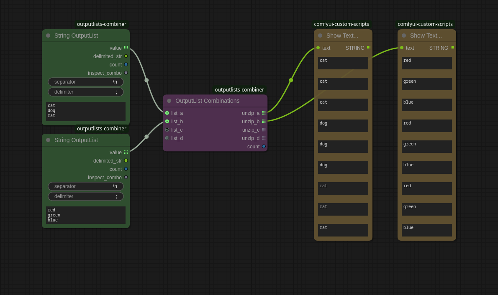

# ComfyUI-outputlists-combiner

Did you know that ComfyUI supports so called output lists which emit values one-by-one and cause a node to be processed multiple times within the same run?

*Wait, what?*

This feature seems very under-utilized but it allows values like images to be collected and processed without crazy workaround like for-loops or external API calls from python scripts. These project implements some core custom nodes which makes working with output lists easier, provides prompt-combinations and easy use of XYZ-gridplots.

## Installation

1. Install [ComfyUI](https://docs.comfy.org/get_started).
1. Install [ComfyUI-Manager](https://github.com/ltdrdata/ComfyUI-Manager)
1. Look up this extension in ComfyUI-Manager. If you are installing manually, clone this repository under `ComfyUI/custom_nodes`.
1. Restart ComfyUI.

## Custom nodes

### String OutputList

Use the `inspect_combo` output to retrieve all values from a `COMBO` input. Then connect `value` to the `COMBO` to iterate over the values:

### Number OutputList

### OutputList Combinations

### Formatted String

## Examples

### Simple Example

### Combine prompts

### Combine samplers and schedulers

### Combine numbers

### Integrating in (LEv145/images-grid-comfy-plugin)[https://github.com/LEv145/images-grid-comfy-plugin]

## Debugging OutputLists

- For strings I recommend comfyui-custom-scripts `Show Text` as it outputs a new line for each emitted item.
- For batches I recommend comfyui_essentials `Debug Tensor Shape` which outputs the tensor shape of the image batch in the console (click the `>_` button in the lower left corner). You'll probably notice that images from the KSampler are outputted as individual items, i.e. batches of size=1, and you probably needed to rebatch them.

### Rebatching images

## TODO

- StringOutputList
  - from string input
  - auto-reconnect inspect_combo but only when value not already connected
  - add count output
- NumberOutputList
  - add count output
- CombineOutputLists
  - add count output
- add rebatcher which supports multiple batch sizes
- add list collector for better integration with other custom nodes
