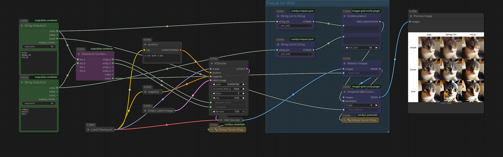

### Integrate LEv145/images-grid-comfy-plugin

**Update** This is no longer relevant. Use `XYZ-Gridplot` node instead! I just keep it if you want to know how to adapt to other custom nodes.

Custom nodes:
* [images-grid-comfy-plugin](https://github.com/LEv145/images-grid-comfy-plugin)
* [Impact-Pack](https://github.com/ltdrdata/ComfyUI-Impact-Pack)
* [ComfyUI_essentials](https://github.com/cubiq/ComfyUI_essentials) (optional)



(workflow included)

Makes use of images-grid-comfy-plugin's `ImagesGridByColumn` + `GridAnnotation` and Impact-Pack's `String List to String` to fit the annotation labels for the grid.

Note that with OutputLists the images from the KSampler are individual items, i.e. `batch_size=1`. But the image-grid node expects batches, that's why we need to rebatch them into `batch_size=9` with the `Rebatch images` core node.

To understand batch_sizes use comfyui_essentials' `Debug Tensor Shape` which outputs the tensor shape of the image batch in the console (click the `>_` button in the lower left corner).

Tensor Shape Debug after KSampler output:
```
Shapes found: [[1, 512, 512, 3]]
Shapes found: [[1, 512, 512, 3]]
Shapes found: [[1, 512, 512, 3]]
Shapes found: [[1, 512, 512, 3]]
Shapes found: [[1, 512, 512, 3]]
Shapes found: [[1, 512, 512, 3]]
Shapes found: [[1, 512, 512, 3]]
Shapes found: [[1, 512, 512, 3]]
Shapes found: [[1, 512, 512, 3]]
```

Tensor shape required for images-grid:
```
[[9, 512, 512, 3]]
```

### Rebatching images for subgrids

**Update** This is no longer relevant. Use `XYZ-Gridplot` node instead! I just keep it if you want to know how to adapt to other custom nodes.

Custom nodes:
* [images-grid-comfy-plugin](https://github.com/LEv145/images-grid-comfy-plugin)
* [Impact-Pack](https://github.com/ltdrdata/ComfyUI-Impact-Pack)
* [ComfyUI_essentials](https://github.com/cubiq/ComfyUI_essentials) (optional)


(workflow included)

Makes use of an additional images-grid to convert a image `batch_size=4` into a 2x2 grid and then rebatches them for main-grid.

Tensor Shape Debug after KSampler output:
```
Shapes found: [[4, 512, 512, 3]]
Shapes found: [[4, 512, 512, 3]]
Shapes found: [[4, 512, 512, 3]]
Shapes found: [[4, 512, 512, 3]]
Shapes found: [[4, 512, 512, 3]]
Shapes found: [[4, 512, 512, 3]]
Shapes found: [[4, 512, 512, 3]]
Shapes found: [[4, 512, 512, 3]]
Shapes found: [[4, 512, 512, 3]]
```

Tensor Shape Debug after first images-grid:
```
Shapes found: [[1, 1024, 1024, 3]]
Shapes found: [[1, 1024, 1024, 3]]
Shapes found: [[1, 1024, 1024, 3]]
Shapes found: [[1, 1024, 1024, 3]]
Shapes found: [[1, 1024, 1024, 3]]
Shapes found: [[1, 1024, 1024, 3]]
Shapes found: [[1, 1024, 1024, 3]]
Shapes found: [[1, 1024, 1024, 3]]
Shapes found: [[1, 1024, 1024, 3]]
```

Tensor Shape Debug required for second images-grid:
```
[[9, 1024, 1024, 3]]
```
