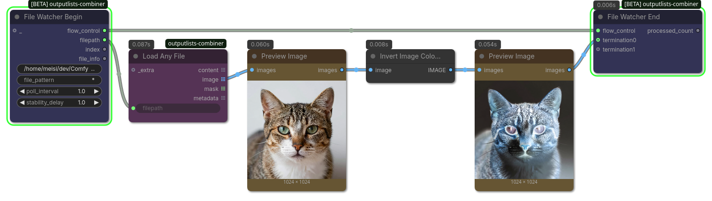

## File Watcher Begin

(ComfyUI workflow included)

Watch a directory for new files and run a sub-workflow once for every file that shows up, one at a time, forever.
You need to connect the `flow_control` from a `FileWatcherBegin` to a `FileWatcherEnd` node.
Unlike `IterateBegin`/`IterateEnd`, this does not iterate a fixed, pre-existing list: it polls `directory` and waits until a new file's size and modification time have stopped changing for `stability_delay` seconds (i.e. it looks fully written), then runs the sub-workflow on it. A file whose name was already processed is picked up again if it later shows up with a different size, modification time, or creation date (e.g. it got overwritten or recreated).
Internally uses the node expansion mechanism which duplicates the sub-workflow again after every processed file, so the loop never really "ends" on its own - cancel the queued prompt to stop it.
On `FileWatcherEnd`, connect every passthrough/output node of the sub-workflow (`Preview Image`, `Save Image`, etc.) into a `termination` slot so the loop only advances once the whole sub-workflow has actually finished running.

### Inputs

| Name | Type | Description |
| --- | --- | --- |
| `directory` | `STRING` | Folder to watch for new files. |
| `file_pattern` | `STRING` | Only files whose name matches this glob pattern are considered, e.g. `*.png`. |
| `poll_interval` | `FLOAT` | Maximum seconds between directory rescans. Also caps how long a single wait can be, even if a file looks like it needs longer to stabilize. |
| `stability_delay` | `FLOAT` | Seconds a file's size must stay unchanged before it's considered fully written and safe to hand off. Set to 0 to disable and grab files as soon as they're seen. |
| `_` | `*` | Ignore! Only used internally |

### Outputs

| Name | Type | Description |
| --- | --- | --- |
| `flow_control` | `FLOW_CONTROL` | You need to connect the `flow_control` from a `FileWatcherBegin` to a `FileWatcherEnd` node. |
| `filepath` | `STRING` | Full path of the new file. |
| `index` | `INT` | How many files have been claimed so far (0-based). |
| `file_info` | `*` | dict with ctime/mtime/atime of the file at the moment it was picked up. Note: st_ctime is creation time on Windows but inode-change time on Linux/Mac. |
