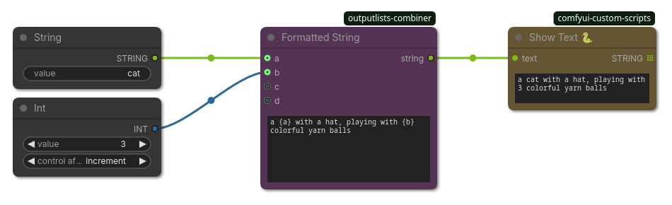

## Formatted String

(ComfyUI workflow included)

Creates a string that contains placeholder variables and replaces them with their respective values.
Uses python `str.format()` internally, see [Python - Format String Syntax](https://docs.python.org/3/library/string.html#format-string-syntax) .
* You can use `{a:.2f}` to round off a float to 2 decimals.
* You can use `{a:05d}` to pad up to 5 leading zeros to fit with comfys filename suffix `ComfyUI_00001_.png`.
* If you want to write `{ }` within your strings (e.g. for JSONs) you have to double them: `{{ }}`.

Also applies *search & replace (S&R) syntax* such as `%date:yyyy-MM-dd hh:mm:ss%` and `%KSampler.seed%`.
Thus you can also use it as a `GET-node`.
Note that "search & replace" takes place in Javascript context and runs before node execution.

### Inputs

| Name | Type | Description |
| --- | --- | --- |
| `fstring` | `STRING` | Creates a string that contains placeholder variables and replaces them with their respective values. Uses python `str.format()` internally, see [Python - Format String Syntax](https://docs.python.org/3/library/string.html#format-string-syntax) . * You can use `{a:.2f}` to round off a float to 2 decimals. * You can use `{a:05d}` to pad up to 5 leading zeros to fit with comfys filename suffix `ComfyUI_00001_.png`. * If you want to write `{ }` within your strings (e.g. for JSONs) you have to double them: `{{ }}`.  Also applies *search & replace (S&R) syntax* such as `%date:yyyy-MM-dd hh:mm:ss%` and `%KSampler.seed%`. Thus you can also use it as a `GET-node`. Note that "search & replace" takes place in Javascript context and runs before node execution. |
| `a` | `*` | (optional) value that will be as a string at the `{a}` placeholder. |
| `b` | `*` | (optional) value that will be as a string at the `{b}` placeholder. |
| `c` | `*` | (optional) value that will be as a string at the `{c}` placeholder. |
| `d` | `*` | (optional) value that will be as a string at the `{d}` placeholder. |

### Outputs

| Name | Type | Description |
| --- | --- | --- |
| `string` | `STRING` | The formatted string with all placeholders replaced with their respective values. |
