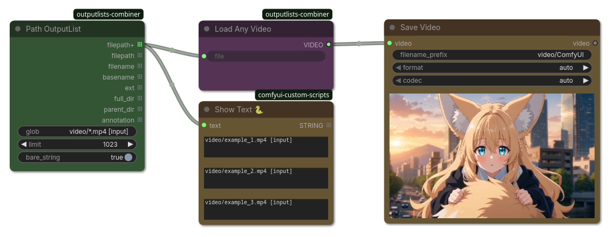

## Path OutputList

(ComfyUI workflow included)

List directory content via glob patterns and split each filepath into it's parts.

`filepath` supports ComfyUI's annotated filepaths `[input]` `[output]` or `[temp]`.
`filepath` also support glob-pattern expansions `subdir/**/*.png`.
Internally uses python's [glob.iglob](https://docs.python.org/3/library/glob.html#glob.iglob).

`bare_strings` is intended for different styles of path recombinations, e.g. "{fulldir}/{basename}.{ext}" vs "{fulldir}{basename}{ext}"

As a design choice the ComfyUI user directory annotation is used in the glob pattern (to allow more flexible patterns) insted of providing a separate variable (in a combo box).

### Inputs

| Name | Type | Description |
| --- | --- | --- |
| `glob` | `STRING` | Glob-pattern expansion `subdir/**/*.png` to list directory content. Base directory defaults to `[input]` user-directory. Use suffix ` [input]` ` [output]` or ` [temp]` (mind the leading whitespace!) to specify a different ComfyUI user-directory. |
| `limit` | `INT` | Limit maximum number of paths to collect (-1.. unlimited) |
| `bare_strings` | `BOOLEAN` | Decides if path-parts only contain the bare strings versus safe OS compliant definitions, e.g. if True `ext` is `png` vs `.png`, `full_dir` is `examples/animals` vs `examples/animals/`, and `parent_dir` may be a empty string vs `./`. Note that `rel_dir` always defaults to `.` |

### Outputs

| Name | Type | Description |
| --- | --- | --- |
| `filepath+` | `* 𝌠` | Full filepath (relative to a ComfyUI directory) including annotations, e.g. `examples/animals/myfile.png [input]`. Recommended if you want to be specific and adhere to ComfyUI's path notation. |
| `filepath` | `STRING 𝌠` | Full filepath (relative to a ComfyUI directory) without annotations, e.g. `examples/animals/myfile.png`. Recommended if you only load files from input directory anways. |
| `filename` | `STRING 𝌠` | Full filename, e.g. `myfile.png` |
| `basename` | `STRING 𝌠` | Basename part of the file without extension, e.g. `myfile` |
| `ext` | `STRING 𝌠` | Extension (e.g. `png` if `bare_strings=True` else `.png'). Note that hidden-files (e.g. `.bashrc`) are considered files without a extension. |
| `full_dir` | `STRING 𝌠` | Full directory of the file (relative to a ComfyUI directory), e.g. `examples/animals` if `bare_strings=True` else `examples/animals/` (note the trailing slash) |
| `parent_dir` | `STRING 𝌠` | Immediate parent directory of the file, e.g. `animals` or empty for empty parent if `bare_strings=True` else `./` |
| `annotation` | `STRING 𝌠` | Annotation to reference the ComfyUI user directory, e.g. `input` if `bare_strings=True` else ` [input]` (note the leading whitespace) |
| `index` | `INT 𝌠` | Range of 0..count. You can use this as an index. |
| `count` | `INT` | Total number of files. |
