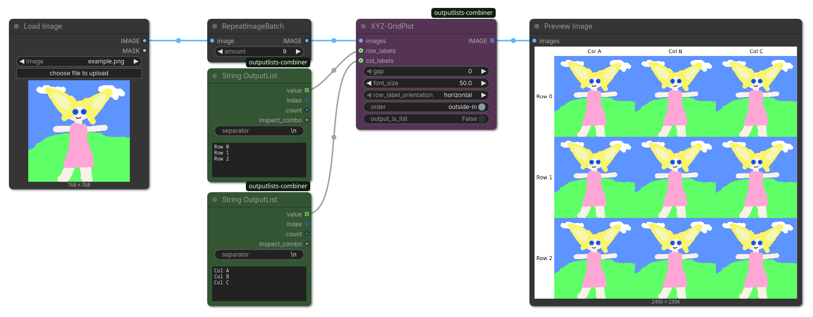

## XYZ-GridPlot

(ComfyUI workflow included)

Generate a XYZ-Gridplot from a list of images.
Takes a list of images (including batches) and will flatten the list first (thus `batch_size=1`).

**Grid shape**
The shape of the grid is determined:
1. by the number of row labels
2. by the number of column labels
3. by the remaining sub-images.
You can use `order=inside_out` to reverse how the images are selected (useful if `batch_size>1` and you want to plot the batches).

**Alignment**
* If a label got wrapped the whole axis is considered "multiline" and will be align at top and justified.
* If all the labels are numbers or all end in parseable numbers (e.g. `strength: 1.`) the whole axis is considered "numeric" and will be right aligned.
* All other texts are considered "singleline" and will be horizontally centered.
* Singleline and numeric labels in columns are vertically aligned at bottom, and in rows are vertically centered.

**Font-size**
* For the column label areas the height is determined by `font_size` or `half of largest sub-images packing height in any row` (whichever is greater).
* For the row label areas the width is determined by the widest width of the sub-images packing (with a minimum of 256px).
* The text will be shrunk down until it fits (down to `font_size_min=6`) and the same font size will be used for the whole axis (row labels or column labels).
If the font size is already at the minimum, any remaining text will be clipped.

**Sub-images packing**
Sub-images (usually from batches) will be shaped into the most square area (the "sub-images packing"), unless `output_is_list=True`, in which case every cell only uses one image and a list of whole image grids will be created instead.
You can use this list of image grids to connect another XyzGridPlot node to create super-grids.
If the sub-images consist of batches of different sizes, the missing cells will be padded.
The number of images per cells (including batched images) have to be a multiple of `rows * columns`.

### Inputs

| Name | Type | Description |
| --- | --- | --- |
| `images` | `IMAGE` | A list of images (including batches) |
| `row_labels` | `*` | The text used for the row labels at the left side |
| `col_labels` | `*` | The text used for the column labels at the top |
| `gap` | `INT` | The gap between the sub-image packing. Note that within the sub-images themselves no gap will be used. If you want a gap between the sub-images connect another XyzGridPlot node. |
| `font_size` | `FLOAT` | The target font size. The text will be shrunk down until it fits (up to `font_size_min=6`). |
| `row_label_orientation` | `COMBO` | The text orientation of the row labels. Useful if you want to save space. |
| `order` | `BOOLEAN` | Defines in which order the images should be processed. This is only relevant if you have sub-images. Useful if `batch_size>1` and you want to plot the batches. |
| `output_is_list` | `BOOLEAN` | This is only relevant if you have sub-images or you want to create super-grids. |

### Outputs

| Name | Type | Description |
| --- | --- | --- |
| `image` | `IMAGE 𝌠` | The XYZ-GridPlot image. If `output_is_list=True` it will be a list of images which you can connect to another XYZ-GridPlot node to create super-grids. |
